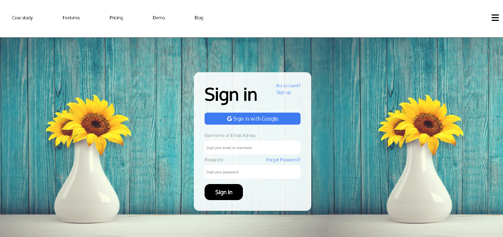

## Exercício 2

Crie um container com Nginx que sirva uma página HTML customizada (index.html). Monte um volume local com esse arquivo para que ele apareça na raiz do site (/usr/share/nginx/html). Acesse a página via http://localhost.

1- Clonando a página html para máquina local

```
git clone https://github.com/Thullyoo/formulario-page-html-css-dribbleinsp.git
```

2- Executar o container com o volume do novo html

```
docker run --name meu_nginx_container -p 80:80 -v <SEU_PATH_DO_HTML_AQUI>:/usr/share/nginx/html nginx:stable-alpine3.21-perl
```

3- Acessar http://localhost:80

