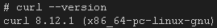

## Exercício 3

Inicie um container da imagem ubuntu com um terminal interativo (bash). Navegue pelo sistema de arquivos e instale o pacote curl utilizando apt.

1- Executar um container com a imagem do ubuntu

```
docker run -it ubuntu:25.10 sh
```

2- Dentro do container realizar a atualização do ubuntu

```
apt update && apt upgrade
```

3- Instalar o curl

```
apt install curl
```

4- Verificar se o curl instalou

