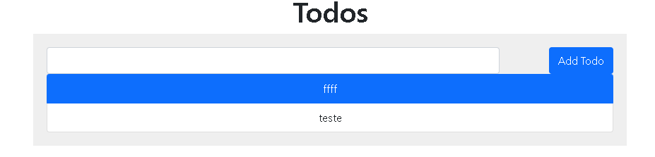

## Exercício 7

Crie uma rede Docker personalizada e faça dois containers, um Node.js e um MongoDB, se comunicarem, sugestão, utilize o projeto React Express + Mongo

1- Criar o docker-compose.yml

```
version: '3.8'

# SERVIÇOS SEPARADOS EM FRONTEND, BACKEND E MONGO
services: 
  frontend:
    restart: always # REINICIA O SERVIÇO SEMPRE QUE DER UM ERRO
    build:
      context: frontend # DIRECIONANDO O LOCAL DO DOCKERFILE
      target: development # DIRECIONANDO O ESTÁGIO DO DOCKERFILE PARA BUILD
    depends_on: # SERVIÇO FRONTEND É DEPENDENTE DO BACKEND, SÓ RODA APÓS O SERVIÇO BACKEND ESTIVER NO AR
      - backend
    ports: # DIRECIONAMENTO DE PORTA HOST PARA O CONTAINER, PARA SER POSSIVEL ACESSAR O SITE LOCALMENTE
      - 3000:3000
    networks: # ADICIONA O SERVIÇO NA REDE FRONTEND-EXPRESS PARA SE CONECTAR COM O SERVIÇO DO BACKEND
      - frontend-express

  backend:
    restart: always # REINICIA O SERVIÇO SEMPRE QUE DER UM ERRO
    build: 
      context: backend # DIRECIONANDO O LOCAL DO DOCKERFILE
      target: development # DIRECIONANDO O ESTÁGIO DO DOCKERFILE PARA BUILD
    depends_on: # SERVIÇO BACKEND É DEPENDENTE DO MONGO, SÓ RODA APÓS O SERVIÇO MONGO ESTIVER NO AR
      - mongo
    expose: # EXPOE A PORTA 3000 PARA O FRONTEND PODER FAZER REQUISIÇÕES
      - 3000
    networks: # ADICIONA O SERVIÇO BACKEND NAS REDES MONGO-EXPRESS E FRONTEND-EXPRESS PARA INTERAGIR COM O MONGO E O FRONTEND
      - mongo-express
      - frontend-express
  
  mongo:
    restart: always # REINICIA O SERVIÇO SEMPRE QUE DER UM ERRO
    image: mongo:latest # SELECIONA A ULTIMA IMAGEM DO MONGO
    expose: # EXPOE A PORTA PADRÃO PARA O BACKEND SE CONECTAR
      - 27017
    networks: # ADICIONA O MONGO A REDE MONGO-EXPRESS PARA QUE O BACKEND CONSIGA INTERAGIR 
      - mongo-express
networks: # SEPARAÇÃO DAS REDES
  frontend-express:
  mongo-express:
```

2- Executar o docker compose

```
docker-compose up --build
```

3- Verificar o resultado no http://localhost:3000


