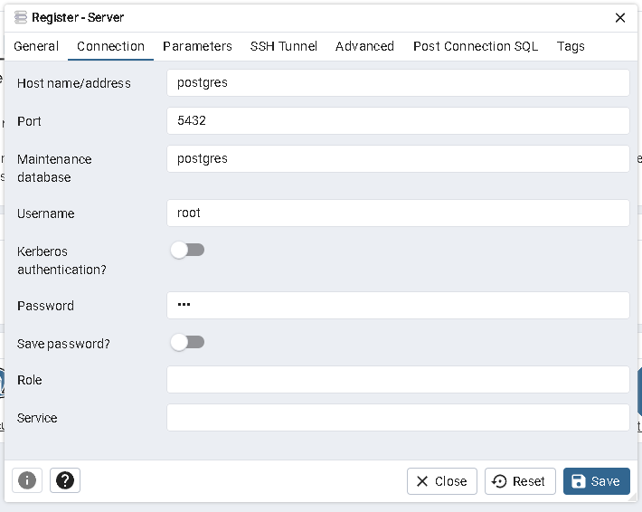
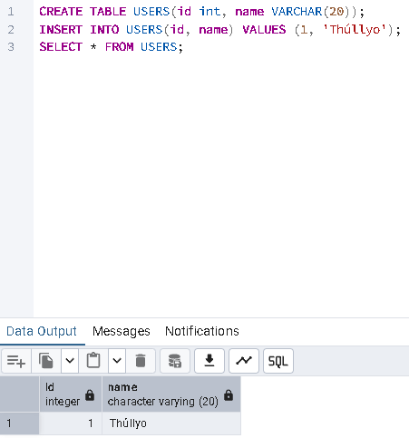

## Exercicio 8

Utilize Docker Compose para configurar uma aplicação com um banco de dados PostgreSQL, use para isso o projeto pgadmin.

1- Criar o docker-compose.yml

```
version: '3.8'
services:
  postgres:
    container_name: postgres
    image: postgres
    restart: always
    environment:
      - POSTGRES_USER=root
      - POSTGRES_PASSWORD=123
    ports:
      - "5432:5432"
  pgadmin:
    container_name: pgadmin
    image: dpage/pgadmin4:latest
    environment:
      - PGADMIN_DEFAULT_EMAIL=admin@admin.com
      - PGADMIN_DEFAULT_PASSWORD=123
    ports:
      - "5050:80"

  
```

2- Subir o docker-compose 

```
docker compose up
```

3- Acessar painel de login do pgadmin no http://localhost:5050 e realizar o login com as credenciais passado no Docker Compose


4- Criar a conexão com o postgres do outro container



5- Criar database, uma tabela e inserir um valor para verificar se está tudo correto



