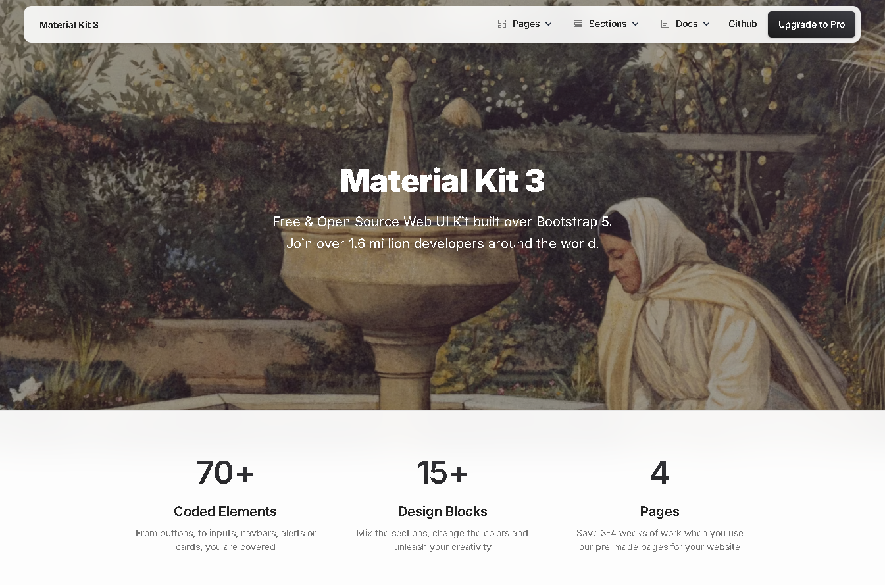

## Exercício 9

Construa uma imagem baseada no Nginx ou Apache, adicionando um site HTML/CSS estático. Utilize a landing page do [Creative Tim](https://github.com/creativetimofficial/material-kit?tab=readme-ov-file#quick-start) para criar uma página moderna hospedada no container.

1- Criar o Dockerfile usando uma image HTTPD e passando a pasta do material kit substituindo a página default do apache

```
FROM httpd:latest
COPY material-kit /usr/local/apache2/htdocs/
EXPOSE 80
```

2- Clonar o repositório do material kit

```
git clone https://github.com/creativetimofficial/material-kit.git
```

3- Fazer a build da image

```
docker build -t apacheteste . 
```

4- Subir um container com essa imagem gerada

```
docker run -d -p 80:80 --name apacheteste apacheteste  
```

5- Verificar no http://localhost:80 se o servidor web está funcionando

