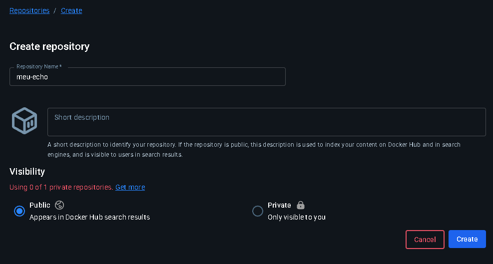
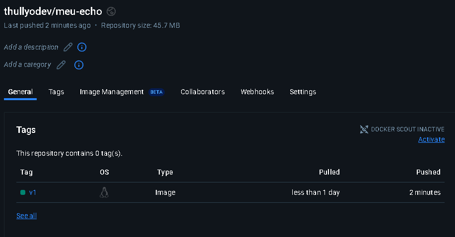

## Exercício 13

Crie um Dockerfile que use a imagem python:3.11-slim, copie um script Python local (app.py) e o execute com CMD. O script pode imprimir a data e hora atual.

a. Crie uma conta no Docker Hub.

b. Faça login pelo terminal com docker login.

c. Rebuild sua imagem meu-echo e a renomeie no formato seu-usuario/meu-echo:v1.

d. Faça o push da imagem para o Docker Hub.

## Resolução

1. Criar arquivo python com a aplicação

**app.py**
```
import datetime 

print("Data atual: " ,datetime.date.today());
```

2. Entrar em uma conta no Docker Hub e criar um novo repositório, e logar na sua máquina local



3. Gerar a imagem e enviar para o Docker Hub

```
docker build -t <seurepositorioaqui>/meu-echo:v1 .
docker push <seurepositorioaqui>/meu-echo:v1   
```

4. Verificar se está no repositório


