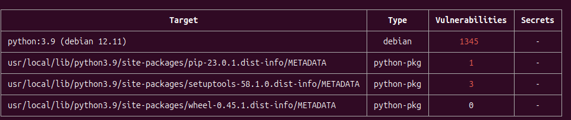
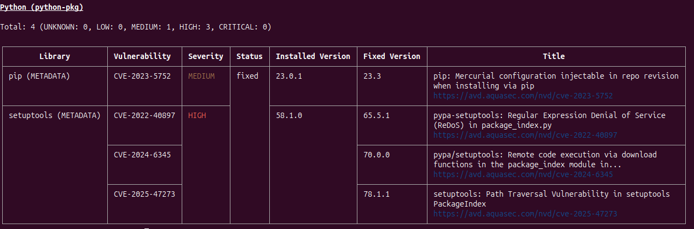

## Exercício 11

Trivy é uma ferramenta open source para análise de vulnerabilidades em imagens Docker. Neste exercício, você irá analisar uma imagem pública, como python:3.9 ou node:16, em busca de vulnerabilidades conhecidas. Você deverá:

e. Instalar o Trivy na sua máquina (via script ou pacote).

f. Rodar trivy image <nome-da-imagem> para analisar.

g. Identificar vulnerabilidades com severidade HIGH ou CRITICAL.

h. Anotar os pacotes ou bibliotecas afetadas e sugerir possíveis ações (como atualização da imagem base ou substituição de dependências).

1- Instalar o trivy (Utilizei o sistema operacional ubuntu)

```
wget https://github.com/aquasecurity/trivy/releases/download/v0.62.1/trivy_0.62.1_Linux-64bit.deb
sudo dpkg -i trivy_0.62.1_Linux-64bit.deb
```

2- Realizar o scan da image

```
trivy image python:3.9
```




3- Analisar os pacotes ou bibliotecas afetadas e sugerir possíveis ações

### 1. CVE-2022-40897 (ALTA)
* **Descrição:** Negação de Serviço por Expressão Regular (ReDoS) no arquivo `package_index.py`.
* **Impacto Potencial:** Um atacante pode explorar esta falha para causar uma negação de serviço, tornando a aplicação indisponível.
* **Versão Corrigida:** `65.5.1`

### 2. CVE-2024-6345 (ALTA)
* **Descrição:** Execução remota de código através de funções de download no módulo `package_index`.
* **Impacto Potencial:** Permite que um atacante execute código arbitrário no sistema onde a biblioteca é utilizada, levando a um comprometimento total.
* **Versão Corrigida:** `70.0.0`

### 3. CVE-2025-47273 (ALTA)
* **Descrição:** Vulnerabilidade de Path Traversal no `PackageIndex` do `setuptools`.
* **Impacto Potencial:** Um atacante pode ser capaz de acessar ou sobrescrever arquivos arbitrários no sistema, levando à execução de código ou divulgação de informações sensíveis.
* **Versão Corrigida:** `70.1.1`

## Ação Necessária: Atualizar `setuptools`

Para corrigir todas as vulnerabilidades listadas, é necessário atualizar a biblioteca `setuptools` para a **versão `70.1.1` ou superior**, pois esta versão engloba as correções para todas as CVEs mencionadas.
