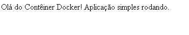
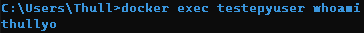

## Exercício 10

Ao rodar containers com o usuário root, você expõe seu sistema a riscos maiores em caso de comprometimento. Neste exercício, você deverá criar um Dockerfile para uma aplicação simples (como um script Python ou um servidor Node.js) e configurar a imagem para rodar com um usuário não-root. Você precisará:

a. Criar um usuário com useradd ou adduser no Dockerfile.

b. Definir esse usuário como o padrão com a instrução USER.

c. Construir a imagem e iniciar o container.

d. Verificar se o processo está rodando com o novo usuário usando docker exec <container> whoami

1- Criar Dockerfile 

```
FROM python:3.14.0b2-alpine3.21

WORKDIR /app

RUN addgroup -g 1234 teste && \
    adduser -D -u 1234 -G teste thullyo

USER thullyo

COPY requirements.txt requirements.txt
RUN pip install --no-cache-dir -r requirements.txt

EXPOSE 5000

COPY app.py .

CMD [ "python", "app.py" ]
```

2- Gerar a image através do dockerfile

```
docker build -t testepyuser .
```

3- Subir um container com a image gerada

```
docker run -d -p 5000:5000  --name testepyuser testepyuser
```

4- Verificar se o site está funcionando no http://localhost:5000



5- Ver qual usuário está sendo usado no container

```
docker exec testepyuser whoami
```


